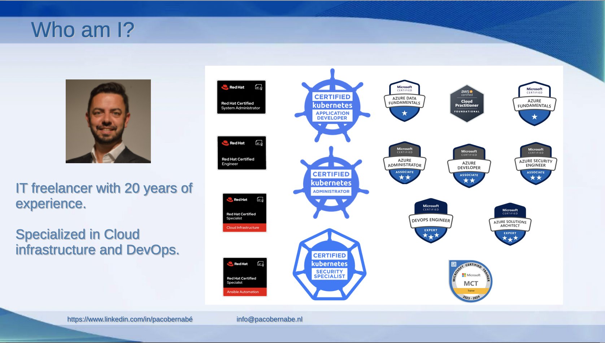
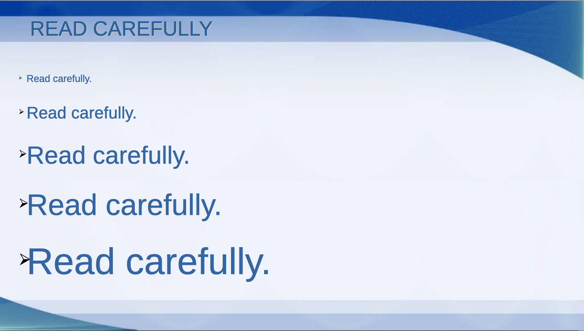

# 1st session: Introduction, Tips&Tricks

## Introduction
This is the first one of a series of 13 sessions to help you ace the Kubernetes Certified Application Developer exam. My name is Paco Bernabé, and I will help you learn the basics of Kubernetes to get this certification. LET'S BEGIN!!!!!

## Who Am I
My name is Paco Bernabé, I'm a IT freelancer specialized in Cloud infrastructure and DevOps. During the last 20 years, I have worked in different companies in all kind of projects. I started as a Linux sysadmin, and in the last years I have helped several clients in their route to the Cloud.

Because this practical guide is about one of the most desired certifications, I also would like to share with you some of the certifications that I have obtained in my career, and that have helped me tremendously to grow as a professional. As you can see, I not only have Kubernetes certifications, but also Azure and Red Hat ones.

## Agenda of the Study Group

During the coming sessions, we will explore the different topics that you need to learn for the CKAD certification. I have split them in a way I thought it was the best, so that related topics can be learn in the same session. The last session is empty, but most probably it will be used to answer more complicated questions of the students.

## Study Strategy Workflow

Let's start with a proper strategy workflow, so that you know what to do between your first day and the exam day. I'm showing you the one that I used. I bought the Kodekloud CKAD course in Udemy, and I followed these steps:

1. I did the whole course by watching the videos and doing the different labs in between.
2. **Labs 1** I repeated all the labs and divided them in 3 categories:
   - The ones that I found easy and I didn't need to repeat
   - The ones that I didn't find difficult, but were I made a mistake
   - The ones I was struggling with, and where I need to look at the solution, or do some serous reading in the documentation.
3. **Labs 2** I took the ones of the 2nd and 3rd categories and repeated them in this stage. 
4. **Labs 3** I only took the ones of the 3rd category and repeated them in this stage. By this stage, all of the exercises should have become as easy the ones in the 1st category. If that was not the case, then I would do extra iterations with them.
5. After the labs, I did the Lightning Labs, which were more complicated exercises about some of the topics. I did those, until I found them easy enough.
6. The same thing goes to the Mock Exams; although these are simulations of what you are going to find during the actual exam. Of course, in this case, you have 2 hours to complete the exercises of the mock exams, just like in the actual one.
7. Then, I used the Killercoda exercises. The advantage of these ones, is that they go directly to the point. By this stage you can be happy that you don't get multiple questions, before the actual exercise.
8. And last but not least, the Killershel Scenarios. When you buy the exam, you get 2 of them for free. In the case of CKAD, these scenarios are more difficult than the actual exam. Every scenario have 25 questions (the CKAD exam has around 15 questions) and, as in the actual exam, you only have 2 hours to complete all the questions. Once you start a scenario, you have 36 hours to repeat it as many times as you want. That's why my advice for this is:
   - Reserve 6 days in a row.
   - The first 4 days (most probably evenings, if you are working) reserve them for the scenarios.
   - The 5th day use it to some last reading and practice, and most important, to rest.
   - Do the exam on the 6th day.
   

## Study Strategy Table
I have created the table below to have an overview of all the topics. You can use it to have a visualization of all the topics, whose labs you will do in the steps Labs(1), Labs(2), and Lab(3) of the previous diagram.

If there's a topic that you find easy after doing the lab, you can mark all 3 columns of the topic (1st, 2nd, and 3rd). Those are the ones that you only do in Labs(1). In the topics where you made a mistake, but where not difficult, you will add only marks in the firts 2 columns, so you can repeat them in Labs(2).

Last but not least, those labs with which you were struggling, will get only one mark in the 1st column, so that you take them to Labs(2), and Labs(3).

This way, you can focus on (and repeat) those that were not easy during Labs(2) and Labs(3), instead of repeating everything.

## Resource Deployment
Kubernetes has many different objects and resources that you can create. With this slide I want to show you the most approppriate and efficient way of creating them; I have split it in 4 ways, depending on what resources these strategies are useful for:

1. You can create them directly from the command line with Kubectl, so that you don't need to fill out an entire manifest from scratch. For some of them (secrets, services, roles, rolebindings). I even recommend to use the help (-h) option, because you get all the parameters that you need; and by the end, there's a line that you can copy/paste into the command line, so that you can fill out whatever you need. It will feel as easy as filling out a form.

2. Even when you use the help option, there are variables that you cannot add from the command line. That's when the dry run comes into play. Just write the whole command and add by the end `--dry-run=client -o yaml > <FILE>` (being <FILE> the name of the file where you will export the manifest), so that can add the necessary variables/parameters in the manifest.

3. When you execute a dry run, you might remember the structure that you need to add into the manifest; but if you don't, the command `kubectl explain` is quite helpful, because you get the whole structure of the manifest, and you can dig into the specific areas that you need. This way, you don't have to memorize anything.

4. Last but not least, the documentation. For some resources, it is even better to just copy/paste the whole manifest, and then change approppriately according to what you need for the exercise. When looking for information in the documentation, don't scroll up or down, but just look for a specific string into the page, which will be faster.

## Verification
Having a strategy to execute is useful and necessary, but that's also the case for the verification. Check out the slide to find out what commands you can use to verify that what you did was correct. This is important, because you might have written a typo in the name of a variable, parameter, or namespace.

## Practical Tips
It is time now for some practical tips, which will save you from non-necessary mistakes that will lead to a failed exam:

1. Use a personal computer, not a business one, with either Mac OS or Windows, and don't try with a VM. The only software that can be running at the time of the exam is the PSI Secure Browser. This will detect if other software is running, and you won't be able to start the exam, until those are off.

2. Be on time before the exam. You can start the onboarding 30 minutes before the start of the exam. Depending on the proctor, it could take a few minutes, or longer. You don't want to consume time of the exam for the onboarding.

3. Make sure that you have an empty desk, where just your computer is on top of. They allowed also a glass of water, but nothing else.

4. Get yourself a laptop with a screen of 14 inches at least. If you don't, you can use an external screen, but make sure that laptop screen is disabled. In this case you will also need an extra mouse, keyboard, camera and microphone.

5. Last but not least; if it's the first time doing this kind of exam, use a couple of minutes to familiarize with the environment, because it's not the most pleasant one.

## The Exam Environment
Have a look at the environment. It is divided in several sections:

1. On the left side, you have the number of questions and the bar with the time that you have left. On the bottom you have a description and the whole text for current question. They have removed the weight for every question; just go from the first one to the last one, mark those 2-3 questions that you cannot quickly solve and leave them until you have completed the rest.

2. On the right side, you have the work area. Open a terminal with 2 tabs (one to work, another to play with `kubectl explain`), also a browser with the documentation (both for Kubernetes and Helm), and make sure that the `Find` option is enabled. Remember to maximize both; you can switch by clicking on the tab on top.

## Final Tips
Have a look at these final tips, as they are as important as knowing anything about Kubernetes for this exam. They will save you from making a silly mistake.

## READ CAREFULLY
Please, read everything carefully. People don't fail because of not knowing a certain topic, but because they didn't read carefully.

## Extra Material
These are some books that will give you more knowledge about Kubernetes. Definitely I recommend **Kubernetes Cookbook** to practice some more exercises for CKAD.

## Questions & Answers
If you got all the way to this slide, thank you very much. Please, feel free to scan the code and to contact me in Linkedin. I will be more than happy of answering your questions.

Remember that this is just the beginning. In the comming sessions, we'll explore all the topics and exercises that you need to ace this certification. Share, enjoy, and good luck.

