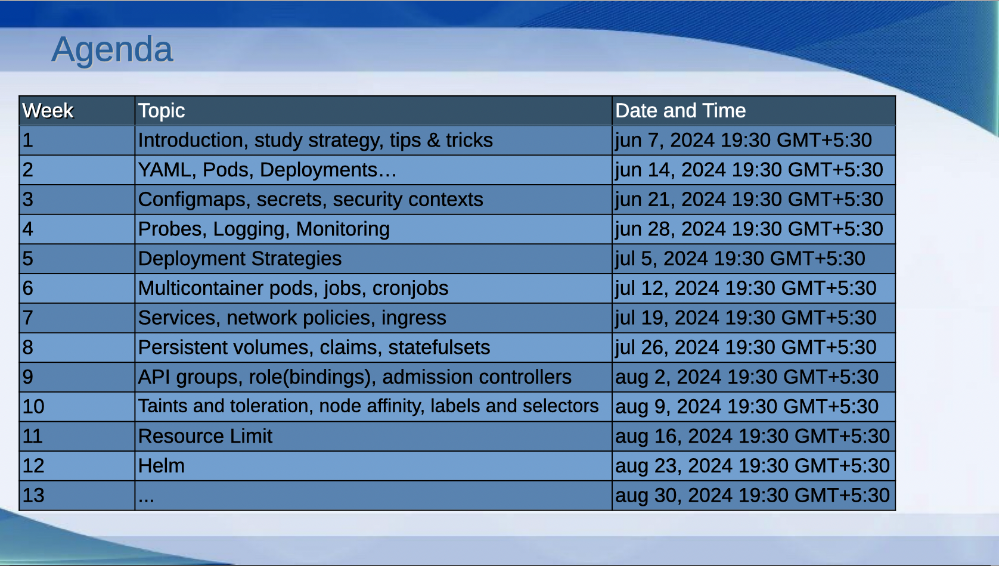
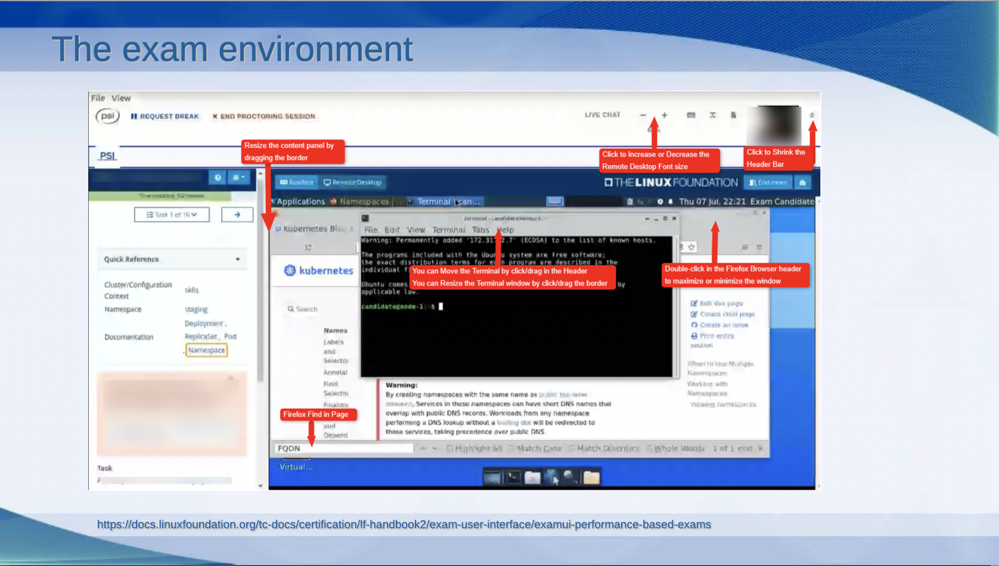
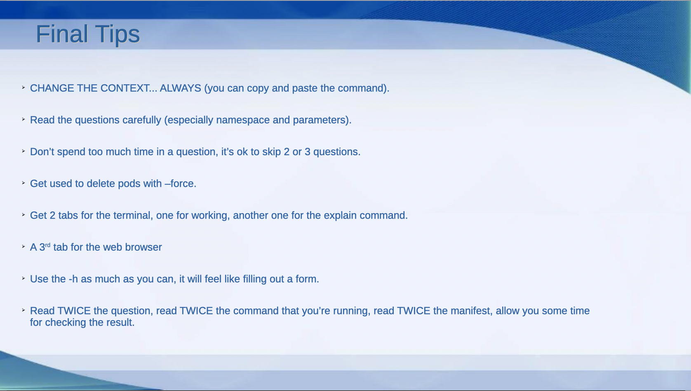
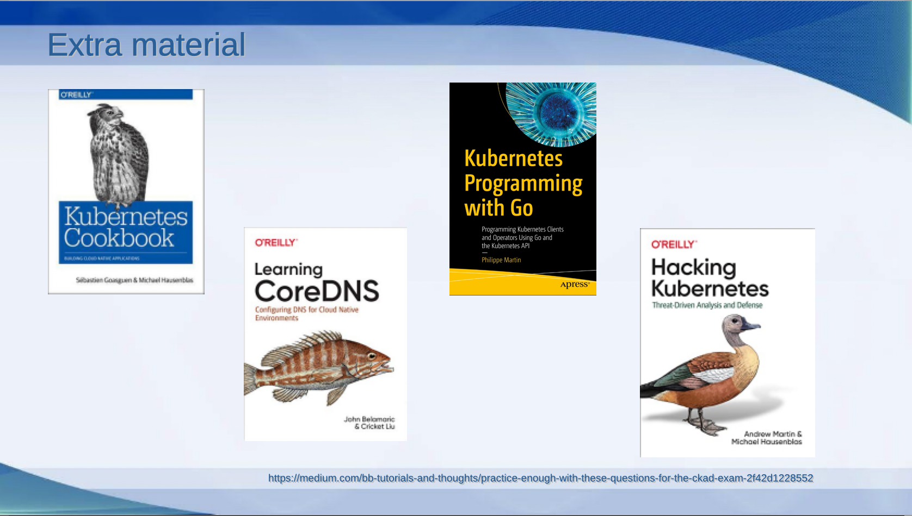

# 1st session: Introduction, Tips&Tricks

## Introduction
This is the first one of a series of 13 sessions to help you ace the Kubernetes Certified Application Developer exam. My name is Paco Bernabé, and I will help you learn the basics of Kubernetes to get this certification. LET'S BEGIN!!!!!

## Who Am I
My name is Paco Bernabé, I'm a IT freelancer specialized in Cloud infrastructure and DevOps. During the last 20 years, I have worked in different companies in all kind of projects. I started as a Linux sysadmin, and in the last years I have helped several clients in their route to the Cloud.

Because this practical guide is about one of the most desired certifications, I also would like to share with you some of the certifications that I have obtained in my career, and that have helped me tremendously to grow as a professional. As you can see, I not only have Kubernetes certifications, but also Azure and Red Hat ones.

## Agenda of the Study Group

During the coming sessions, we will explore the different topics that you need to learn for the CKAD certification. I have split them in a way I thought it was the best, so that related topics can be learn in the same session. The last session is empty, but most probably it will be used to answer more complicated questions of the students.

## Study Strategy Workflow

Let's start with a proper strategy workflow, so that you know what to do between your first day and the exam day. I'm showing you the one that I used. I bought the Kodekloud CKAD course in Udemy, and I followed these steps:

1. I did the whole course by watching the videos and doing the different labs in between.
2. **Labs 1** I repeated all the labs and divided them in 3 categories:
   - The ones that I found easy and I didn't need to repeat
   - The ones that I didn't find difficult, but were I made a mistake
   - The ones I was struggling with, and where I need to look at the solution, or do some serous reading in the documentation.
3. **Labs 2** I took the ones of the 2nd and 3rd categories and repeated them in this stage. 
4. **Labs 3** I only took the ones of the 3rd category and repeated them in this stage. By this stage, all of the exercises should have become as easy the ones in the 1st category. If that was not the case, then I would do extra iterations with them.

## Study Strategy Table

## Resource Deployment

## Verification

## Practical Tips

## The Exam Environment

## Final Tips

## READ CAREFULLY

## Extra Material

## Questions & Answers

