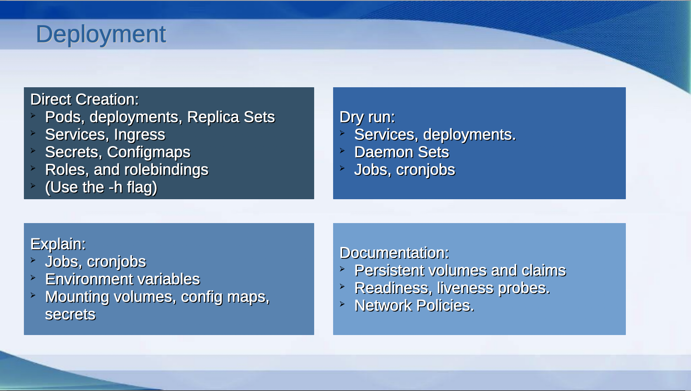
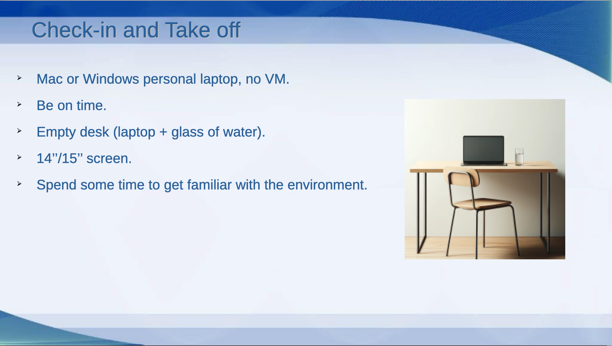

# 1st session: Introduction, Tips&Tricks

## Introduction
This is the first one of a series of 13 sessions to help you ace the Kubernetes Certified Application Developer exam. My name is Paco Bernabé, and I will help you learn the basics of Kubernetes to get this certification. LET'S BEGIN!!!!!

## Who Am I
My name is Paco Bernabé, I'm a IT freelancer specialized in Cloud infrastructure and DevOps. During the last 20 years, I have worked in different companies in all kind of projects. I started as a Linux sysadmin, and in the last years I have helped several clients in their route to the Cloud.

Because this practical guide is about one of the most desired certifications, I also would like to share with you some of the certifications that I have obtained in my career, and that have helped me tremendously to grow as a professional. As you can see, I not only have Kubernetes certifications, but also Azure and Red Hat ones.

## Agenda of the Study Group

During the coming sessions, we will explore the different topics that you need to learn for the CKAD certification. I have split them in a way I thought it was the best, so that related topics can be learn in the same session. The last session is empty, but most probably it will be used to answer more complicated questions of the students.

## Study Strategy Workflow

Let's start with a proper strategy workflow, so that you know what to do between your first day and the exam day. I'm showing you the one that I used. I bought the Kodekloud CKAD course in Udemy, and I followed these steps:

1. I did the whole course by watching the videos and doing the different labs in between.
2. **Labs 1** I repeated all the labs and divided them in 3 categories:
   - The ones that I found easy and I didn't need to repeat
   - The ones that I didn't find difficult, but were I made a mistake
   - The ones I was struggling with, and where I need to look at the solution, or do some serous reading in the documentation.
3. **Labs 2** I took the ones of the 2nd and 3rd categories and repeated them in this stage. 
4. **Labs 3** I only took the ones of the 3rd category and repeated them in this stage. By this stage, all of the exercises should have become as easy the ones in the 1st category. If that was not the case, then I would do extra iterations with them.
5. After the labs, I did the Lightning Labs, which were more complicated exercises about some of the topics. I did those, until I found them easy enough.
6. The same thing goes to the Mock Exams; although these are simulations of what you are going to find during the actual exam. Of course, in this case, you have 2 hours to complete the exercises of the mock exams, just like in the actual one.
7. Then, I used the Killercoda exercises. The advantage of these ones, is that they go directly to the point. By this stage you can be happy that you don't get multiple questions, before the actual exercise.
8. And last but not least, the Killershel Scenarios. When you buy the exam, you get 2 of them for free. In the case of CKAD, these scenarios are more difficult than the actual exam. Every scenario have 25 questions (the CKAD exam has around 15 questions) and, as in the actual exam, you only have 2 hours to complete all the questions. Once you start a scenario, you have 36 hours to repeat it as many times as you want. That's why my advice for this is:
   - Reserve 6 days in a row.
   - The first 4 days (most probably evenings, if you are working) reserve them for the scenarios.
   - The 5th day use it to some last reading and practice, and most important, to rest.
   - Do the exam on the 6th day.
   

## Study Strategy Table
I have created the table below to have an overview of all the topics. You can use it to have a visualization of all the topics, whose labs you will do in the steps Labs(1), Labs(2), and Lab(3) of the previous diagram.

If there's a topic that you find easy after doing the lab, you can mark all 3 columns of the topic (1st, 2nd, and 3rd). Those are the ones that you only do in Labs(1). In the topics where you made a mistake, but where not difficult, you will add only marks in the firts 2 columns, so you can repeat them in Labs(2).

Last but not least, those labs with which you were struggling, will get only one mark in the 1st column, so that you take them to Labs(2), and Labs(3).

This way, you can focus on (and repeat) those that were not easy during Labs(2) and Labs(3), instead of repeating everything.

## Resource Deployment
Kubernetes has many different objects and resources that you can create. With this slide I want to show you the most approppriate and efficient way of creating them. There are 4 ways of creating them:

1. You can create them directly from the command line with Kubectl; you don't need to fill out an entire manifest from scratch. For some of them (secrets, services, roles, rolebindings), I even recommend to use the help (-h) option, because

## Verification

## Practical Tips

## The Exam Environment

## Final Tips

## READ CAREFULLY

## Extra Material

## Questions & Answers

