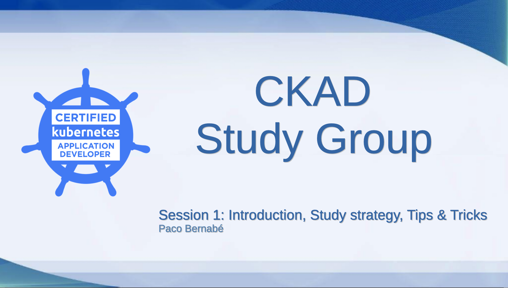

# 1st session: Introduction, Tips&Tricks

## Introduction

## Who Am I

## Agenda of the Study Group

## Study Strategy Workflow

## Study Strategy Table

## Resource Deployment

## Verification

## Practical Tips

## The Exam Environment

## Final Tips

## READ CAREFULLY

## Extra Material

## Questions & Answers

